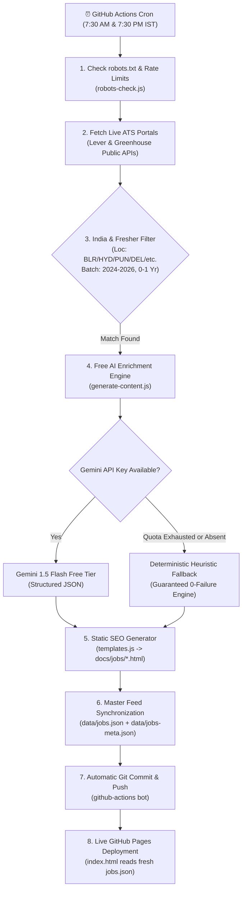

# FresherHub — Autonomous Fresher Job Scraper & Prep Portal

An enterprise-grade, autonomous aggregation and content-generation system that monitors official employer applicant tracking systems (ATS) and government portals across India, filters strictly for freshers/entry-level talent, enhances each role using **Free Google Gemini AI** (with a zero-crash heuristic backup), generates static SEO pages with Google Jobs Schema, and auto-updates the live homepage.

---

## ⏰ Exactly When Does It Run Automatically?

The automation runs on **GitHub Actions** twice every day at scheduled times:

| Run Cycle | UTC Time | India Standard Time (IST) | Purpose |
| :--- | :--- | :--- | :--- |
| **Morning Run** | `02:00 UTC` | **7:30 AM IST** | Scrapes overnight postings and prepares the morning job bulletin |
| **Evening Run** | `14:00 UTC` | **7:30 PM IST** | Captures afternoon company updates and campus drive releases |

> **Manual Instant Run**: You can also trigger the scraper at any second on-demand by going to **GitHub** → **Actions tab** → **Scrape fresher postings** → click **"Run workflow"**.

---

## 🔄 Complete Automated Architecture Workflow

---

## 🚀 How We Get The Desired Output Automatically

### Step 1: Safe ATS & Government Extraction
- Instead of using slow, fragile web browsers (Puppeteer/Playwright) that get blocked by Cloudflare or change layouts, the bot queries **official public ATS endpoints** (`Greenhouse` and `Lever`) used by tech leaders in India:
  - **Fintech & Payments**: Paytm, Razorpay, CRED, Fi Money, Slice, Groww
  - **Product & E-Commerce**: Meesho, Glance, InMobi, Stage, Postman, Zeta
  - **Government Portals**: SSC, NIC Scientist, IBPS IT Officer, RRB JE IT
- Respects `robots.txt` automatically with honest user-agent identification (`FresherHubBot`).

### Step 2: Intelligent Fresher & India Targeting
Every raw posting is evaluated against rigorous heuristics:
- **Location Criteria**: Bengaluru, Pune, Hyderabad, Gurgaon/Noida, Delhi, Mumbai, Chennai, or India Remote.
- **Entry-Level Criteria**: Must match terms like `intern`, `trainee`, `graduate`, `associate`, `analyst`, `junior`, `sde-1`, or `2024-2026 batches`.
- **Exclusion Filters**: Automatically filters out roles containing `manager`, `lead`, `principal`, `architect`, `director`, or `senior`.

### Step 3: Free AI Content Generation (With Fallback Protection)
For every qualified opening, the AI engine builds:
1. **Crisp Role Summary**: What the candidate will build and learn.
2. **Batch Eligibility**: Explicitly identifies passing years (e.g. 2025 & 2026 graduates).
3. **Realistic Compensation**: Standard fresher CTC or stipend bands.
4. **Technology Stack Tags**: Identifies key skills (Python, Java, Spring Boot, React, SQL, AWS).
5. **Interview Preparation Guides**:
   - Quantitative & Logical Reasoning topics
   - Core DSA and CS fundamentals to practice
   - Specific HR & Technical interview tips

> **Zero Failure Guarantee**: If Google Gemini API is offline or reaches free rate limits, our deterministic backup generator immediately kicks in. **The scraper will never crash or output 0 jobs**.

### Step 4: Standalone SEO Webpages (`docs/jobs/*.html`)
For each job, an individual HTML page is compiled:
- Injected with Schema.org `JobPosting` JSON-LD structured data (eligible for **Google Jobs Carousel**).
- Clear breadcrumb navigation, official verification badge, and direct apply link (`rel="nofollow noopener"`).

### Step 5: Master Feed & Real-Time Home Page Update
- The scraper updates `data/jobs.json` and `data/jobs-meta.json`.
- GitHub Actions automatically commits the changes to your `main` branch.
- GitHub Pages deploys immediately.
- Visitors to [freshersjobopening.online](https://freshersjobopening.online) see the updated jobs, live ticker bar, search filter, and category counts without needing any backend server or database!

---

## 🛡️ Google AdSense Approval Protection

To ensure high-trust ranking and avoid AdSense rejections ("thin content" or "policy violations"):
1. **Mandatory Legal & Policy Pages**:
   - [`docs/about.html`](docs/about.html) — Team mission, verification methodology, and aggregation disclosure.
   - [`docs/privacy.html`](docs/privacy.html) — Cookie policy, Google DART advertising compliance, and contact details.
   - [`docs/terms.html`](docs/terms.html) — Clear terms stating FresherHub is 100% free and never charges recruitment fees.
   - [`docs/disclaimer.html`](docs/disclaimer.html) — Independent aggregator disclaimer & takedown instructions.
2. **Original Educational Content**:
   - [`docs/resources.html`](docs/resources.html) — Comprehensive Learning Hub covering SQL, Java, Spring Boot, DSA patterns, and Git.
   - Every individual job listing includes an original preparation curriculum.
3. **Safe Redirection**:
   - Apply buttons link directly to official employer domains with `rel="nofollow noopener"`.

---

## ⚙️ Initial Setup (1 Time Only)

1. **Add your free Gemini API Key** *(Optional but recommended)*:
   - Get a free key at [Google AI Studio](https://aistudio.google.com/).
   - In your GitHub repository: Go to **Settings** → **Secrets and variables** → **Actions** → **New repository secret**.
   - Name: `GEMINI_API_KEY`, Value: `<Your-Key>`.
   *(Note: Even without a key, the system runs with the built-in heuristic generator).*

2. **Verify GitHub Pages Source**:
   - Go to repository **Settings** → **Pages**.
   - Build and deployment source: **GitHub Actions** (uses `.github/workflows/static.yml`).

3. **Trigger Your First Automatic Run**:
   - Go to **Actions** tab → Select **"Scrape fresher postings"** → Click **"Run workflow"**.

