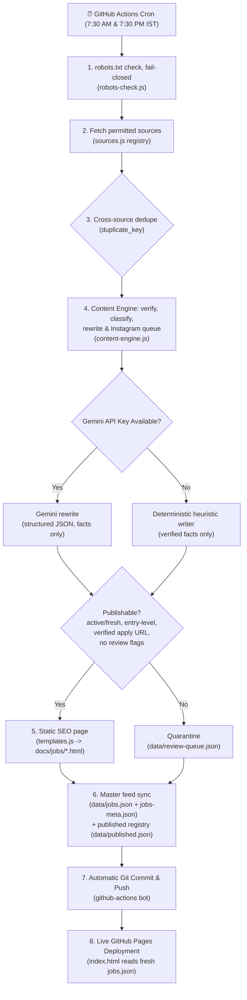

# FresherHub — Fresher Job Aggregation Pipeline

An autonomous aggregation system that monitors official employer applicant tracking systems (ATS) and a fresher-focused job board across India, filters for entry-level relevance using evidence from the complete posting, rewrites each role in original wording with a **zero-fabrication guarantee**, generates static SEO pages with Google Jobs Schema, and updates the live homepage.

**Core rule: never invent information.** Every field on the site is either a verified fact from the source posting or an honest `"Not specified"`.

---

## ⏰ Exactly When Does It Run Automatically?

The automation runs on **GitHub Actions** twice every day at scheduled times:

| Run Cycle | UTC Time | India Standard Time (IST) | Purpose |
| :--- | :--- | :--- | :--- |
| **Morning Run** | `02:00 UTC` | **7:30 AM IST** | Scrapes overnight postings and prepares the morning job bulletin |
| **Evening Run** | `14:00 UTC` | **7:30 PM IST** | Captures afternoon company updates and campus drive releases |

> **Manual Instant Run**: You can also trigger the scraper at any second on-demand by going to **GitHub** → **Actions tab** → **Scrape fresher postings** → click **"Run workflow"**.

---

## 🔄 Complete Automated Architecture Workflow



---

## 🚀 How We Get The Desired Output Automatically

### Step 1: Source Registry (`scraper/sources.js`)
Every source lives in one registry with a per-source `checkUrl` pointing at the exact host+path we fetch. `robots-check.js` verifies permission before any request and **fails closed**: an unreachable or disallowing `robots.txt` skips the source for that run. Requests carry an honest bot user-agent and respect crawl-delay. In sandboxed environments, Node's native fetch honors `HTTP_PROXY`/`HTTPS_PROXY` when `NODE_USE_ENV_PROXY=1` (see `scraper/http.js`).

Current permitted sources (458; every entry live-verified 2026-09-25):
- **Lever public postings API** (`api.lever.co` — robots `Allow: /`, crawl-delay 1): 95 IT companies (Paytm, Meesho, CRED, Zeta, Waabi, Weekday, Xsolla…)
- **Greenhouse public boards API** (`boards-api.greenhouse.io` — only `/embed/` disallowed): 141 IT companies (Postman, Razorpay, InMobi, Groww, CloudSEK, Fastly, Together AI…)
- **Ashby public job-posting API** (`api.ashbyhq.com` — [documented public API](https://developers.ashbyhq.com/docs/public-job-posting-api) built for job boards/feed partners; the API host's `robots.txt` is WAF-blocked so the robots gate is bypassed for this kind only, flagged `publicApi: true` per source): 140 IT companies (n8n, Coder, Granola, Sarvam AI…)
- **Keka career portals** (`{tenant}.keka.com/careers` — robots `Allow: /careers`): 71 Indian IT companies (10Decoders, Minfy, Signzy, Wingify, Valorem, Academian…)
- **Govt notice boards** (10 official recruitment pages — NPCIL, BPCL, HPCL, C-DAC, PowerGrid, IOCL, SBI, IBPS, LIC, UPSC): conservative anchor extractor keeps only recruitment notices (results/admit cards/tenders/fraud alerts dropped); WAF-challenge pages yield nothing. Thin evidence → content engine quarantines.
- **HireDoor public job board** (`hiredoor.in/jobs` — robots allows `/jobs`; `/api/` is disallowed and never touched): first 5 pages, detail pages fetched politely (~0.7s between requests). HireDoor is a *discovery* source — its "Verified" badge and estimated salaries are never republished as facts. A HireDoor listing is only treated as live when its external official application link is verified reachable by our own probe.

Step 1 fetches sources with bounded concurrency (8, `SOURCE_CONCURRENCY` override); per-source politeness (robots check + crawl-delay) is preserved.

Verify all sources live without publishing anything:
```bash
cd scraper && node scrape.js --verify-sources
```
This writes `data/source-check.json` with per-source candidate counts.

### Step 2: Entry-Level & India Relevance (evidence-based)
Every raw posting is evaluated against the **complete posting**, not the title alone:
- **Location**: India-based or India-remote roles only.
- **Entry-level evidence**: explicit fresher/graduate/intern/trainee/0–1-year language in the full description. Senior signals anywhere in the posting (`senior`, `lead`, `4–5 years`, etc.) exclude it, even if the title sounds junior.
- **Freshness**: `active` only with live evidence — a listing returned by the source's live postings API (Lever/Greenhouse/Keka "active" endpoints), or a HireDoor listing whose external official application link we verified reachable in this run. Expired, removed, or unverifiable postings are never published.

### Step 3: Content Engine — Verification, Rewrite, Instagram (Zero Fabrication)
Every qualified opening is processed by `scraper/content-engine.js`, which returns one publication-ready JSON payload per job:

- **verification** — freshness `status` (`active` only with live evidence — see Step 2), entry-level classification (`fresher` / `entry_level` / `graduate` / `student` / `internship` / `experienced` / `unknown`) with explicit evidence strings, a stable `duplicate_key` (a listing seen again in a later run is re-verified and kept live, never duplicated or wrongly quarantined), and a confidence score.
- **source** — `source_url`, `source_name`, `company_url`, `official_application_url` (kept strictly separate; a URL that can't be confidently identified becomes `null`, never a guess).
- **job** — factual fields only. Salary, location, dates, and requirements are extracted verbatim from the posting; anything absent becomes `"Not specified"` — the engine **never invents** salary bands, vacancies, batches, or benefits.
- **website_content** — original-language rewrite: summary, responsibilities, requirements, preferred qualifications, skills, benefits. Gemini (free tier) rewrites verified facts when a key is configured; the deterministic heuristic writer guarantees output otherwise. Long source passages are never copied verbatim.
- **instagram** — headline, subheadline, key points, CTA, caption, and hashtags, generated from verified facts only (no hype phrases like "guaranteed job" or "100% hiring"). Queued in `data/instagram-queue.json`; when a creative image exists for the job, the entry also carries its `image` path (`docs/instagram/<slug>.png`).
- **quality_checks** — `facts_invented`, `salary_verified`, `application_url_verified`, `potential_duplicate`, and `needs_human_review` with a `review_reason`. Flagged jobs land in `data/review-queue.json` for manual review before publication, mirroring a HireDoor-style verified-badge workflow.

Full payloads are archived in `data/content-engine.json` on every run. Demo the engine locally with `node content-engine.js --demo` (prints pure JSON), and run the test suite with `node test-content-engine.js`.

> **Graceful degradation**: if the Google Gemini API is offline or hits free-tier rate limits, the deterministic heuristic writer takes over automatically. A run can still legitimately output 0 jobs — for example when every source returns nothing new, or every candidate is quarantined for failing the publication bar.

### Step 4: Publish or Quarantine
A job reaches the public site only when it is **active, entry-level, sufficiently evidenced, and has a verified official application URL**. Everything else — experienced roles, closed postings, thin/unverifiable listings, review flags — goes to `data/review-queue.json` and never touches the public feed.

Published jobs get an individual static HTML page with Schema.org `JobPosting` JSON-LD (eligible for **Google Jobs Carousel**), XSS-escaped rendering, and an apply button (`rel="nofollow noopener"`) that links only to the verified official URL.

### Step 5: Prep Guides + Instagram Creatives (Gemini, fully automatic)
After publishing, each run generates two more asset types for jobs that don't have them yet (new jobs only, per-run caps keep the job bounded):

- **Interview prep guides** (`scraper/generate-articles.js`) — one static page per job at `docs/guides/<slug>-interview-prep.html`, drafted by Gemini strictly from the verified posting facts (role overview, what the role involves, skills to prepare, interview topics, application checklist). Prep topics are labeled as general guidance, never presented as the company's actual process. AI output is schema-validated, URL-stripped, and HTML-escaped; a guides index is rebuilt at `docs/guides/index.html`, and job pages automatically link their guide once it exists.
- **Instagram creatives** (`scraper/generate-photos.js`) — a 1080×1350 portrait job-alert card per job via Gemini image generation, saved to `docs/instagram/<slug>.png` and linked from the matching `data/instagram-queue.json` entry. Only short verified strings (company, title, location) go into the image prompt.

Both modules skip quietly when `GEMINI_API_KEY` is not configured and never fail the scrape run. Note: actually *posting* to Instagram still needs your one-time Meta setup (Business/Creator account + linked Facebook Page + app with the content-publishing permission) — no automation can bypass that, so the queue + creatives are the handoff point.

`data/published.json` tracks every published job's first-seen and last-seen dates: "posted" labels stay stable across runs, re-verified jobs are never duplicated, and pages vanish from the source for 45+ days are pruned.

### Step 5: Master Feed & Real-Time Home Page Update
- The scraper updates `data/jobs.json` and `data/jobs-meta.json`.
- GitHub Actions automatically commits the changes to your `main` branch.
- GitHub Pages deploys immediately.
- Visitors to [freshersjobopening.online](https://freshersjobopening.online) see the updated jobs, live ticker bar, search filter, and category counts without needing any backend server or database!

---

## 🛡️ Google AdSense Approval Protection

To ensure high-trust ranking and avoid AdSense rejections ("thin content" or "policy violations"):
1. **Mandatory Legal & Policy Pages**:
   - [`docs/about.html`](docs/about.html) — Team mission, verification methodology, and aggregation disclosure.
   - [`docs/privacy.html`](docs/privacy.html) — Cookie policy, Google DART advertising compliance, and contact details.
   - [`docs/terms.html`](docs/terms.html) — Clear terms stating FresherHub is 100% free and never charges recruitment fees.
   - [`docs/disclaimer.html`](docs/disclaimer.html) — Independent aggregator disclaimer & takedown instructions.
2. **Original Educational Content**:
   - [`docs/resources.html`](docs/resources.html) — Comprehensive Learning Hub covering SQL, Java, Spring Boot, DSA patterns, and Git.
   - Every individual job listing includes an original preparation curriculum.
3. **Safe Redirection**:
   - Apply buttons link directly to official employer domains with `rel="nofollow noopener"`.

---

## ⚙️ Initial Setup (1 Time Only)

1. **Add your free Gemini API Key** *(Optional but recommended)*:
   - Get a free key at [Google AI Studio](https://aistudio.google.com/).
   - In your GitHub repository: Go to **Settings** → **Secrets and variables** → **Actions** → **New repository secret**.
   - Name: `GEMINI_API_KEY`, Value: `<Your-Key>`.
   *(Note: Even without a key, the system runs with the built-in heuristic generator).*

2. **Verify GitHub Pages Source**:
   - Go to repository **Settings** → **Pages**.
   - Build and deployment source: **GitHub Actions** (uses `.github/workflows/static.yml`).

3. **Trigger Your First Automatic Run**:
   - Go to **Actions** tab → Select **"Scrape fresher postings"** → Click **"Run workflow"**.

